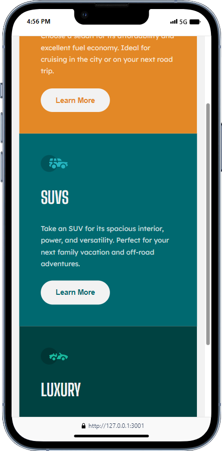
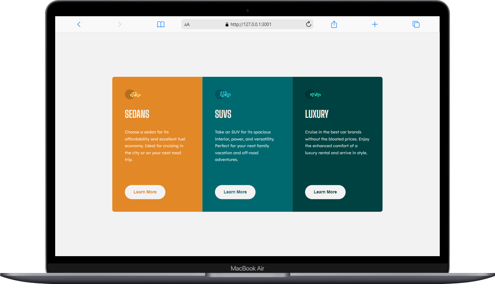

# Frontend Mentor - 3-column preview card component solution

This is a solution to the [3-column preview card component challenge on Frontend Mentor](https://www.frontendmentor.io/challenges/3column-preview-card-component-pH92eAR2-). Frontend Mentor challenges help you improve your coding skills by building realistic projects.

## Table of contents

- [Overview](#overview)
  - [The challenge](#the-challenge)
  - [Screenshot](#screenshot)
  - [Links](#links)
- [My process](#my-process)
  - [Built with](#built-with)
- [Author](#author)
  
## Overview

### The challenge

Users should be able to:

- View the optimal layout depending on their device's screen size
- See hover states for interactive elements

### Screenshot

|               Mobile                |                Desktop                |
| :---------------------------------: | :-----------------------------------: |
|  |  |

### Links

- Solution URL: [here](https://github.com/asmaahamid02/3-column-preview-card-component)
- Live Site URL: [here](https://asmaahamid02.github.io/3-column-preview-card-component)

## My process

### Built with

- Semantic HTML5 markup
- CSS custom properties
- Flexbox
- Mobile-first workflow

## Author

- Website - [Asmaa Hamid](https://linktr.ee/asmaa.codes)
- Frontend Mentor - [@asmaahamid02](https://www.frontendmentor.io/profile/asmaahamid02)
- LinkedIn - [Asmaa Hamid](https://www.linkedin.com/in/asmaa-hamid-4656a4288/)
- Instagram - [@asmaa.codes](https://www.instagram.com/asmaa.codes/)
- TikTok - [@asmaa.codes](https://www.tiktok.com/@asmaa.codes)
